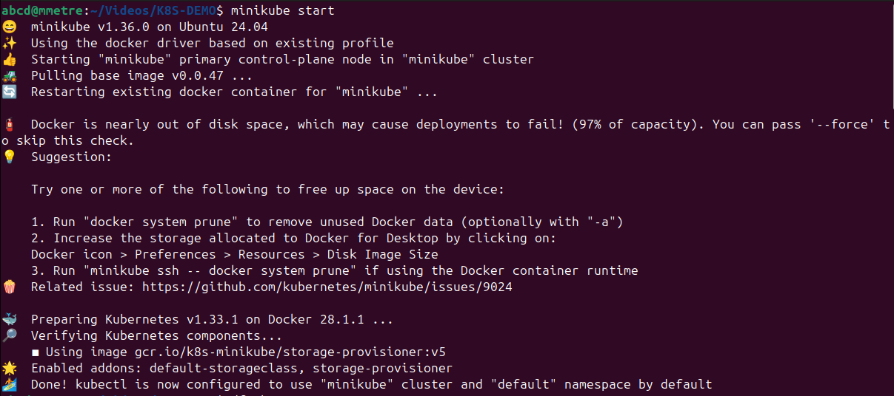
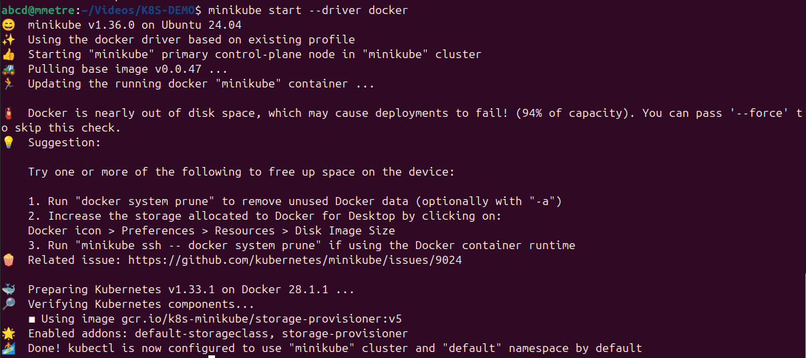
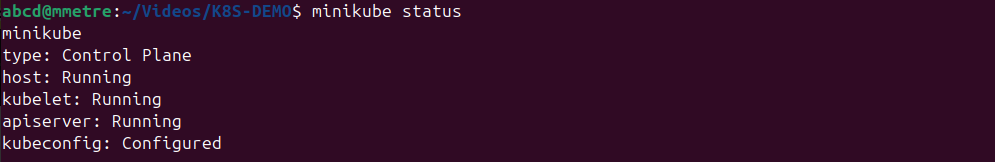
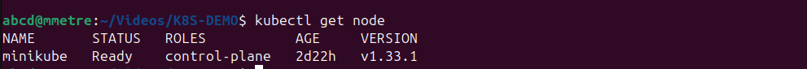
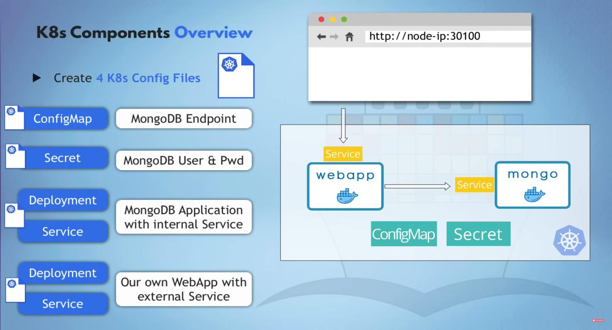
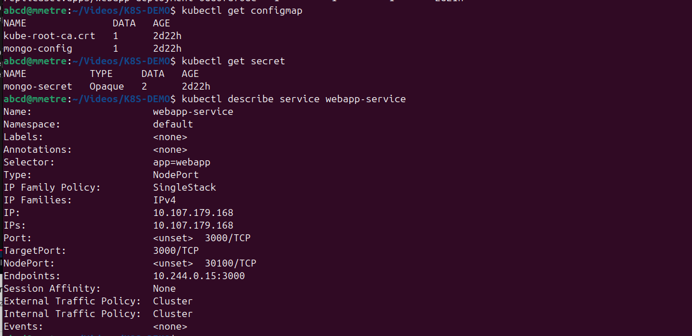
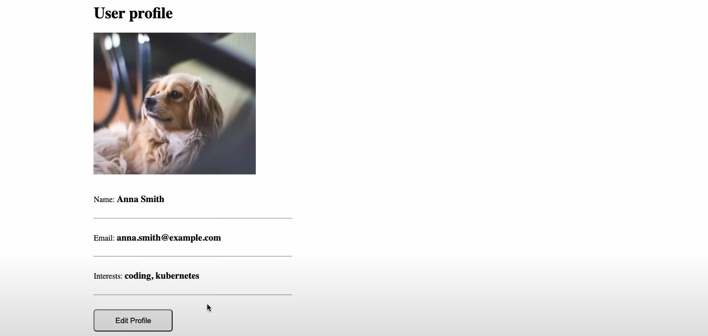

**🚀 Kubernetes Project --- Hands-on Setup and Management with
Minikube**

This document is a walkthrough of my **Kubernetes project** where I
deploy a basic application stack using Minikube on Ubuntu 24.04. Each
step below includes commands.

**🚀 Step 1: Start Minikube**

minikube start

*Output:*

> • Minikube version: v1.36.0\
> • Kubernetes version: v1.33.1\
> • Driver: Docker\
> • Warnings about Docker disk usage

**🚀 Re-run Minikube with Docker Driver** minikube start \--driver
docker

✅ **Step 2: Check Minikube Status**\
minikube status

**🚀 Step 3: Check Cluster Node Info**\
kubectl get node

**🚀 Useful CLI Info**

> • kubectl: used for configuring and managing Kubernetes resources •
> minikube: used for cluster management (start, delete, etc.)

**🚀 Step 4: Apply YAML Configuration Files**

Refer to:

kubectl a\
kubectl apply -f mongo-secret.yaml\
kubectl apply -f mongo.yaml\
kubectl apply -f webapp.yaml

**🚀 Step 5: Kubernetes Resource Monitoring Commands**

kubectl get node\
kubectl get all\
kubectl get secret

kubectl get pod\
kubectl get configmap\
kubectl help\
kubectl get \--help\
kubectl describe service \<service-name\>\
kubectl describe pod \<pod-name\>

Resulting webpage on my local:

This hands-on demo was a great exercise in managing a Kubernetes
environment locally, simulating real-world microservices deployment with
secrets, configs, and persistent services.
